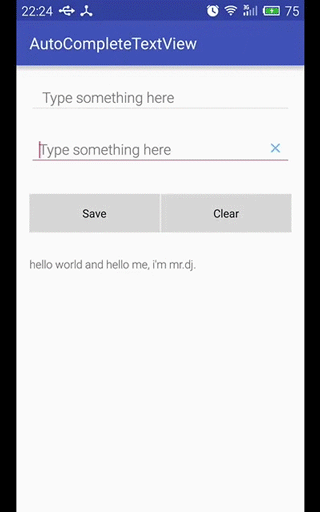

## AutoCompleteTextView

#### AutoCompleteTextView常用属性

|属性|描述|
|----|----|
|android:completionHint|设置出现在下拉菜单底部的提示信息|
|android:completionThreshold|设置触发补全提示信息的字符个数|
|android:dropDownHorizontalOffset|设置下拉菜单于文本框之间的水平偏移量|
|android:dropDownHeight|设置下拉菜单的高度|
|android:dropDownWidth|设置下拉菜单的宽度|
|android:singleLine|设置单行显示文本内容|
|android:dropDownVerticalOffset|设置下拉菜单于文本框之间的垂直偏移量|

----

#### 使用ArrayAdapter来作为AutoCompleteTextView的数据适配器

- 简单的xml布局

```xml
<AutoCompleteTextView
    android:id="@+id/tv_search"
    android:layout_width="match_parent"
    android:layout_height="wrap_content"
    android:hint="@string/hint_type"
    android:completionHint="@string/chint_recent"
    android:completionThreshold="1" />
```

- 默认AutoCompleteTextView中的数据保存在SharedPreferences中，故将SharedPreferences做了简单的API封装以方便数据存取，详细的SharedPreferences请参考这里：**[SharedPreferences][sp_link]**

[sp_link]: http://www.jianshu.com/p/19bc0db1e5be

```java
// 从SharedPreferences中获取历史记录数据
private String getHistoryFromSharedPreferences(String key) {
    SharedPreferences sp = getSharedPreferences(SP_NAME, MODE_PRIVATE);
    return sp.getString(key, SP_EMPTY_TAG);
}

// 将历史记录数据保存到SharedPreferences中
private void saveHistoryToSharedPreferences(String key, String history) {
    SharedPreferences sp = getSharedPreferences(SP_NAME, MODE_PRIVATE);
    SharedPreferences.Editor editor = sp.edit();
    editor.putString(key, history);
    editor.apply();
}

// 清除保存在SharedPreferences中的历史记录数据
private void clearHistoryInSharedPreferences() {
    SharedPreferences sp = getSharedPreferences(SP_NAME, MODE_PRIVATE);
    SharedPreferences.Editor editor = sp.edit();
    editor.clear();
    editor.apply();
}
```

- 使用默认适配器的AutoCompleteTextView相关初始化

```java
private void initSearchView() {
    mSearchTv = (AutoCompleteTextView) findViewById(R.id.tv_search);
    String[] mSearchHistoryArray = getHistoryArray(SP_KEY_SEARCH);
    mSearchAdapter = new ArrayAdapter<>(
            this,
            android.R.layout.simple_dropdown_item_1line,
            mSearchHistoryArray
    );
    mSearchTv.setAdapter(mSearchAdapter);  // 设置适配器

    // 设置下拉提示框的高度为200dp
    // mAutoCompleteTv.setDropDownHeight();      // 或XML中为android:dropDownHeight="200dp"

    // 默认当输入2个字符以上才会提示， 现在当设置输入1个字符就自动提示
    // mAutoCompleteTv.setThreshold(1);          // 或XML中为android:completionThreshold="1"

    // 设置下拉提示框中底部的提示
    // mAutoCompleteTv.setCompletionHint("最近的5条记录");

    // 设置单行输入限制
    // mAutoCompleteTv.setSingleLine(true);
}

private String[] getHistoryArray(String key) {
    String[] array = getHistoryFromSharedPreferences(key).split(SP_SEPARATOR);
    if (array.length > MAX_HISTORY_COUNT) {         // 最多只提示最近的50条历史记录
        String[] newArray = new String[MAX_HISTORY_COUNT];
        System.arraycopy(array, 0, newArray, 0, MAX_HISTORY_COUNT); // 实现数组间的内容复制
    }
    return array;
}
```

- 保存AutoCompleteTextView中的历史记录数据到SharedPreferences中

```java
private void saveSearchHistory() {
    String text = mSearchTv.getText().toString().trim();       // 获取搜索框文本信息
    if (TextUtils.isEmpty(text)) {                      // null or ""
        Toast.makeText(this, "Please type something again.", Toast.LENGTH_SHORT).show();
        return;
    }

    String old_text = getHistoryFromSharedPreferences(SP_KEY_SEARCH);// 获取SP中保存的历史记录
    StringBuilder sb;
    if (SP_EMPTY_TAG.equals(old_text)) {
        sb = new StringBuilder();
    } else {
        sb = new StringBuilder(old_text);
    }
    sb.append(text + SP_SEPARATOR);      // 使用逗号来分隔每条历史记录

    // 判断搜索内容是否已存在于历史文件中，已存在则不再添加
    if (!old_text.contains(text + SP_SEPARATOR)) {
        saveHistoryToSharedPreferences(SP_KEY_SEARCH, sb.toString());  // 实时保存历史记录
        mSearchAdapter.add(text);        // 实时更新下拉提示框中的历史记录
        Toast.makeText(this, "Search saved: " + text, Toast.LENGTH_SHORT).show();
    } else {
        Toast.makeText(this, "Search existed: " + text, Toast.LENGTH_SHORT).show();
    }
}
```

上面代码中，为了能够实时更新下拉提示框中的历史记录，需要在保存数据后再调用`ArrayAdapter.add()`方法，而不是调用`ArrayAdapter.notifyDataSetChanged()`。

- 实时清除下拉提示框中的历史记录

```java
clearHistoryInSharedPreferences();          // 试试清除历史记录
mSearchAdapter.clear();                     // 实时清除下拉提示框中的历史记录
```

- 效果演示


----

#### 使用自定义AutoCompleteAdapter来作为AutoCompleteTextView的数据适配器

- 简单的xml布局

使用RelativeLayout来容纳AutoCompleteTextView和ImageView，其中ImageView位于右侧，用于点击清除AutoCompleteTextView的内容

```xml
<RelativeLayout
    android:layout_width="match_parent"
    android:layout_height="wrap_content"
    android:layout_marginTop="20dp"
    android:gravity="center_vertical">

    <AutoCompleteTextView
        android:id="@+id/tv_custom"
        android:layout_width="match_parent"
        android:layout_height="wrap_content"
        android:paddingStart="12dp"
        android:paddingEnd="40dp"
        android:hint="@string/hint_type"/>

    <ImageView
        android:id="@+id/iv_custom"
        android:layout_width="20dp"
        android:layout_height="20dp"
        android:layout_marginEnd="10dp"
        android:layout_alignParentEnd="true"
        android:layout_centerVertical="true"
        android:scaleType="fitCenter"
        android:src="@drawable/ic_action_name"
        android:contentDescription="@null"/>
</RelativeLayout>
```

- 使用自定义适配器的AutoCompleteTextView相关初始化

```java
private void initCustomView() {
    mCustomTv = (AutoCompleteTextView) findViewById(R.id.tv_custom);
    mDeleteIv = (ImageView) findViewById(R.id.iv_custom);
    mDeleteIv.setOnClickListener(new View.OnClickListener() {
        @Override
        public void onClick(View v) {
            mCustomTv.setText("");              // 清空TextView的内容
        }
    });

    ArrayList<String> mOriginalValues = new ArrayList<>();
    String[] mCustomHistoryArray = getHistoryArray(SP_KEY_CUSTOM);
    mOriginalValues.addAll(Arrays.asList(mCustomHistoryArray));     // String[] => ArrayList<String>
    
    mCustomAdapter = new AutoCompleteAdapter(this, mOriginalValues);
    mCustomAdapter.setDefaultMode(AutoCompleteAdapter.MODE_STARTSWITH | AutoCompleteAdapter.MODE_SPLIT);// 设置匹配模式

    simpleItemHeight = mCustomAdapter.getSimpleItemHeight();
    Toast.makeText(this, "simpleItemHeight: " + simpleItemHeight, Toast.LENGTH_SHORT).show(); // 103

    mCustomAdapter.setOnFilterResultsListener(new AutoCompleteAdapter.OnFilterResultsListener() {
        @Override
        public void onFilterResultsListener(int count) {
            curCount = count;
            if (count > MAX_ONCE_MATCHED_ITEM) {        // 限制提示框最多要显示的记录行数
                curCount = MAX_ONCE_MATCHED_ITEM;
            }
            if (curCount != prevCount) {                // 仅当目前的数目和之前的不同才重新设置下拉框高度，避免重复设置
                prevCount = curCount;
                mCustomTv.setDropDownHeight(simpleItemHeight * curCount);
            }
        }
    });

    mCustomAdapter.setOnSimpleItemDeletedListener(new AutoCompleteAdapter.OnSimpleItemDeletedListener() {
        @Override
        public void onSimpleItemDeletedListener(String value) {
            String old_history = getHistoryFromSharedPreferences(SP_KEY_CUSTOM);    // 获取之前的记录
            String new_history = old_history.replace(value + SP_SEPARATOR, "");    // 用空字符串替换掉要删除的记录
            saveHistoryToSharedPreferences(SP_KEY_CUSTOM, new_history);             // 保存修改过的记录
        }
    });

    mCustomTv.setAdapter(mCustomAdapter);       //
    mCustomTv.setThreshold(1);                  //

    // 设置下拉时显示的提示行数 (此处不设置也可以，因为在AutoCompleteAdapter中有专门的事件监听来实时设置提示框的高度)
    // mCustomTv.setDropDownHeight(simpleItemHeight * MAX_ONCE_MATCHED_ITEM);
}
```

- 保存AutoCompleteTextView中的历史记录数据到SharedPreferences中

```java
private void saveCustomHistory() {
    String text = mCustomTv.getText().toString().trim();     // 获取搜索框信息
    if (TextUtils.isEmpty(text)) {          // null or ""
        Toast.makeText(this, "Please type something again.", Toast.LENGTH_SHORT).show();
        return;
    }

    String old_text = getHistoryFromSharedPreferences(SP_KEY_CUSTOM);    // 获取SP中保存的历史记录
    StringBuilder sb;
    if (SP_EMPTY_TAG.equals(old_text)) {
        sb = new StringBuilder();
    } else {
        sb = new StringBuilder(old_text);
    }
    sb.append(text + SP_SEPARATOR);      // 使用逗号来分隔每条历史记录

    // 判断搜索内容是否已存在于历史文件中，已存在则不再添加
    if (!old_text.contains(text + SP_SEPARATOR)) {
        saveHistoryToSharedPreferences(SP_KEY_CUSTOM, sb.toString());  // 实时保存历史记录
        mCustomAdapter.add(text);        // 实时更新下拉提示框中的历史记录
        Toast.makeText(this, "Custom saved: " + text, Toast.LENGTH_SHORT).show();
    } else {
        Toast.makeText(this, "Custom existed: " + text, Toast.LENGTH_SHORT).show();
    }
}
```

- 实时清除下拉提示框中的历史记录

```java
clearHistoryInSharedPreferences();      // 试试清除历史记录
mCustomAdapter.clear();                 // 实时清除下拉提示框中的历史记录
```

- 自定义适配器AutoCompleteAdapter

AutoCompleteAdapter参考了ArrayAdapter的部分源代码，继承自`BaseAdapter`并实现`Filterable`接口，实现了以下功能：

1. 实现自动补全的匹配模式的配置，有三种可选匹配模式：MODE_CONTAINS / MODE_STARTSWITH(default) / MODE_SPLIT
2. 实现匹配成功事件的回调，用于根据匹配结果数来动态设置下拉提示框的高度
3. 实现删除匹配结果中子项的事件回调，用于实时更新存储在SharedPreferences的历史记录数据

```java
public class AutoCompleteAdapter extends BaseAdapter implements Filterable {

    private static final int MODE_NONE = 0x000;                 // 0000b
    public static final int MODE_CONTAINS = 0x001;              // 0001b
    public static final int MODE_STARTSWITH = 0x002;            // 0010b
    public static final int MODE_SPLIT = 0x004;                 // 0100b
    private static final String SPLIT_SEPARATOR = "[,.\\s]+";  // 分隔符，默认为空白符、英文逗号、英文句号
    private static boolean isFound = false;   // 当MODE_STARTSWITH模式匹配成功时，不再进行MODE_SPLIT模式的匹配
    private int defaultMode = MODE_STARTSWITH;                  // 0110b

    private LayoutInflater inflater;
    private ArrayFilter mArrayFilter;
    private ArrayList<String> mOriginalValues;      // 所有的item
    private List<String> mObjects;                  // 过滤后的item
    private final Object mLock = new Object();      // 同步锁
    private int maxMatch = 10;                      // 最多显示的item数目，负数表示全部
    private int simpleItemHeight;                   // 单行item的高度值，故需要在XML中固定父布局的高度值

    public AutoCompleteAdapter(Context context, ArrayList<String> mOriginalValues) {
        this(context, mOriginalValues, -1);
    }

    public AutoCompleteAdapter(Context context, ArrayList<String> mOriginalValues, int maxMatch) {
        this.mOriginalValues = mOriginalValues;
        // 初始化时将其设置成mOriginalValues，避免在未进行数据保存时执行删除操作导致程序的崩溃
        this.mObjects = mOriginalValues;   
        this.maxMatch = maxMatch;
        inflater = LayoutInflater.from(context);
        initViewHeight();
    }

    private void initViewHeight() {
        View view = inflater.inflate(R.layout.simple_dropdown_item_1line, null);
        LinearLayout linearLayout = (LinearLayout) view.findViewById(R.id.layout_item);
        linearLayout.measure(0, 0);
        // 其他方法获取的高度值会因View尚未被绘制而获取到0
        simpleItemHeight = linearLayout.getMeasuredHeight();
    }

    public int getSimpleItemHeight() {
        return simpleItemHeight;                // 5 * 2 + 28(dp) => 103(px)
    }

    @Override
    public int getCount() {
        return mObjects.size();
    }

    @Override
    public Object getItem(int position) {
        return mObjects.get(position);
    }

    @Override
    public long getItemId(int position) {
        return position;
    }

    @Override
    public View getView(final int position, View convertView, ViewGroup parent) {
        ViewHolder holder;
        if (convertView == null) {
            holder = new ViewHolder();
            convertView = inflater.inflate(R.layout.simple_dropdown_item_1line, null);
            holder.tv = (TextView) convertView.findViewById(R.id.tv_simple_item);
            holder.iv = (ImageView) convertView.findViewById(R.id.iv_simple_item);
            convertView.setTag(holder);
        } else {
            holder = (ViewHolder) convertView.getTag();
        }
        holder.tv.setText(mObjects.get(position));
        holder.iv.setOnClickListener(new View.OnClickListener() {
            @Override
            public void onClick(View v) {
                String value = mObjects.remove(position);

                if (mDeleteListener != null) {
                    mDeleteListener.onSimpleItemDeletedListener(value);
                }

                if (mFilterListener != null) {
                    mFilterListener.onFilterResultsListener(mObjects.size());
                }

                mOriginalValues.remove(value);
                notifyDataSetChanged();
            }
        });

        return convertView;
    }

    private static class ViewHolder {
        TextView tv;
        ImageView iv;
    }

    public void setDefaultMode(int defaultMode) {
        this.defaultMode = defaultMode;
    }

    public void add(String item) {
        mOriginalValues.add(item);
        notifyDataSetChanged();         //
    }

    public void clear() {
        if(mOriginalValues != null && !mOriginalValues.isEmpty()) {
            mOriginalValues.clear();
            notifyDataSetChanged();         //
        }
    }

    // Interface
    public interface OnSimpleItemDeletedListener {
        void onSimpleItemDeletedListener(String value);
    }

    private OnSimpleItemDeletedListener mDeleteListener;

    public void setOnSimpleItemDeletedListener(OnSimpleItemDeletedListener listener) {
        this.mDeleteListener = listener;
    }

    // Interface
    public interface OnFilterResultsListener {
        void onFilterResultsListener(int count);
    }

    private OnFilterResultsListener mFilterListener;

    public void setOnFilterResultsListener(OnFilterResultsListener listener) {
        this.mFilterListener = listener;
    }

    @Override
    public Filter getFilter() {
        if (mArrayFilter == null) {
            mArrayFilter = new ArrayFilter(mFilterListener);
        }
        return mArrayFilter;
    }

    private class ArrayFilter extends Filter {

        private OnFilterResultsListener listener;

        public ArrayFilter(OnFilterResultsListener listener) {
            this.listener = listener;
        }

        @Override
        protected FilterResults performFiltering(CharSequence prefix) {
            FilterResults results = new FilterResults();

            if (mOriginalValues == null) {
                synchronized (mLock) {
                    mOriginalValues = new ArrayList<>(mObjects);
                }
            }

            if (prefix == null || prefix.length() == 0) {
                synchronized (mLock) {
                    ArrayList<String> list = new ArrayList<>(mOriginalValues);
                    results.values = list;
                    results.count = list.size();
                }
            } else {
                String prefixString = prefix.toString().toLowerCase();      // prefixString
                final int count = mOriginalValues.size();                   // count
                final ArrayList<String> newValues = new ArrayList<>(count); // newValues

                for (int i = 0; i < count; i++) {
                    final String value = mOriginalValues.get(i);            // value
                    final String valueText = value.toLowerCase();           // valueText

                    // 1. 匹配所有
                    if ((defaultMode & MODE_CONTAINS) != MODE_NONE) {
                        if (valueText.contains(prefixString)) {
                            newValues.add(value);
                        }
                    } else {    // support: defaultMode = MODE_STARTSWITH | MODE_SPLIT
                        // 2. 匹配开头
                        if ((defaultMode & MODE_STARTSWITH) != MODE_NONE) {
                            if (valueText.startsWith(prefixString)) {
                                newValues.add(value);
                                isFound = true;
                            }
                        }
                        // 3. 分隔符匹配，效率低
                        if (!isFound && (defaultMode & MODE_SPLIT) != MODE_NONE) {
                            final String[] words = valueText.split(SPLIT_SEPARATOR);
                            for (String word : words) {
                                if (word.startsWith(prefixString)) {
                                    newValues.add(value);
                                    break;
                                }
                            }
                        }
                        if(isFound) {   // 若在MODE_STARTSWITH模式中匹配，则再次复位进行下一次判断
                            isFound = false;
                        }
                    }

                    if (maxMatch > 0) {             // 限制显示item的数目
                        if (newValues.size() > maxMatch - 1) {
                            break;
                        }
                    }
                } // for (int i = 0; i < count; i++)
                results.values = newValues;
                results.count = newValues.size();
            }

            return results;
        }

        @Override
        protected void publishResults(CharSequence constraint, FilterResults results) {
            //noinspection unchecked
            mObjects = (List<String>) results.values;

            if (results.count > 0) {
                // 由于当删除提示框中的记录行时，而AutoCompleteTextView此时内容又不改变，故不会触发FilterResults事件
                // 导致删除记录行时，提示框的高度不会发生相应的改变
                // 解决方法：需要在ImageView的点击监听器中也调用OnFilterResultsListener.onFilterResultsListener()
                // 来共同完成
                if (listener != null) {
                    listener.onFilterResultsListener(results.count);
                }
                notifyDataSetChanged();
            } else {
                notifyDataSetInvalidated();
            }
        }
    }
}
```

- 下拉提示框的item布局simple_dropdown_item_1line.xml

这里需要固定父类控件LinearLayout的高度，在AutoCompleteAdapter中会获取其高度用于设置AutoCompleteTextView的下拉菜单的高度

```xml
<?xml version="1.0" encoding="utf-8"?>
<LinearLayout xmlns:android="http://schemas.android.com/apk/res/android"
    android:id="@+id/layout_item"
    android:orientation="horizontal"
    android:layout_width="match_parent"
    android:layout_height="28dp"
    android:padding="5dp"
    android:gravity="center_vertical">

    <TextView
        android:id="@+id/tv_simple_item"
        android:layout_width="0dp"
        android:layout_height="wrap_content"
        android:layout_weight="1"
        android:paddingStart="5dp"
        android:paddingEnd="0dp"
        android:text="@string/text_nothing"
        android:textAllCaps="false"
        android:textSize="18sp"
        android:textColor="#000"/>

    <ImageView
        android:id="@+id/iv_simple_item"
        android:layout_width="18dp"
        android:layout_height="18dp"
        android:layout_marginEnd="5dp"
        android:src="@drawable/ic_action_name"
        android:contentDescription="@null"
        android:scaleType="fitCenter" />
</LinearLayout>
```

- 效果演示
 
